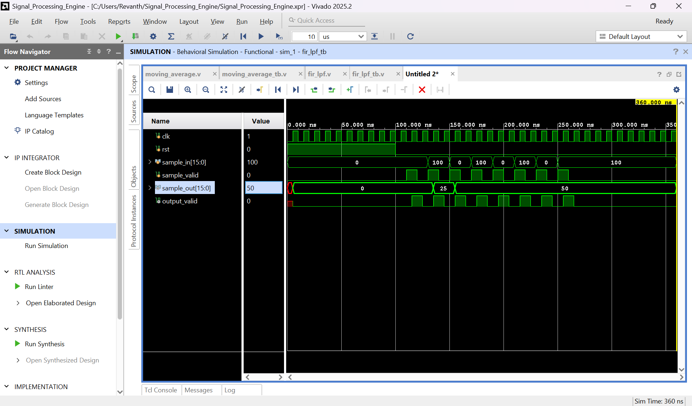
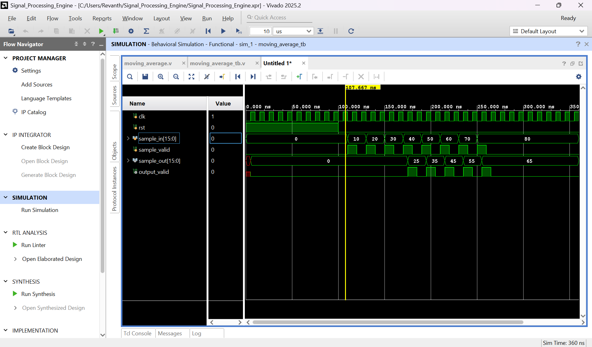
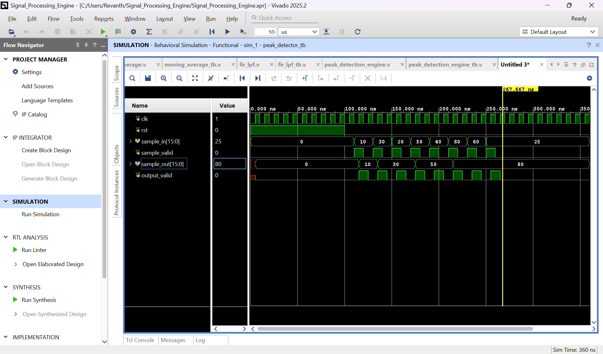
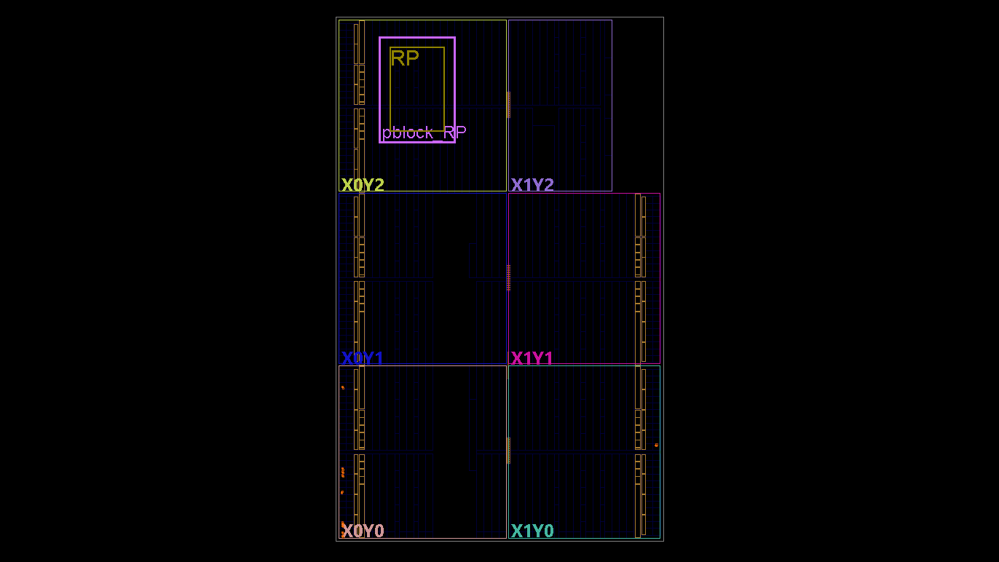

# DFX-Based Signal Processing Engine

## CAPTURE THE BITSTREAM Hackathon — Problem 2

This directory contains my implementation of **Problem 2: Signal Processing Engine** from the **CAPTURE THE BITSTREAM Hackathon**.

The objective of this problem is to demonstrate **Dynamic Function eXchange (DFX)** by implementing multiple signal-processing functions that can occupy the same reconfigurable region of the FPGA.

The design contains three signal-processing implementations:

- **FIR Low-Pass Filter**
- **Moving Average Filter**
- **Peak Detection Engine**

These modules share a common interface and are designed to operate as alternative implementations of the **Reconfigurable Partition (RP)**.

The design targets the **Digilent Basys 3 FPGA board**.

---

# Design Overview

Dynamic Function eXchange allows a portion of the FPGA to be reconfigured while the remaining static logic continues to operate.

In this implementation, the signal-processing function is placed inside a dedicated reconfigurable partition named:

```text
RP
```

The processing function inside this partition can be changed between:

```text
                +----------------------+
sample_in ----->|                      |
sample_valid -->|  Reconfigurable      |-----> sample_out
                |  Partition (RP)      |-----> output_valid
                |                      |
                +----------+-----------+
                           |
             +-------------+-------------+
             |             |             |
             v             v             v
         FIR LPF      Moving Average    Peak
                                      Detection
```

The static portion of the design provides the common interface, while the selected signal-processing engine performs the actual sample processing.

---

# Processing Modes

## 1. FIR Low-Pass Filter

The FIR low-pass filter performs weighted filtering on the incoming sample stream.

The filter stores previous samples and combines them according to the implemented FIR coefficients.

Conceptually:

```text
Input Samples
     |
     v
+----------------+
| Sample Delay   |
| / FIR Stages   |
+----------------+
     |
     v
+----------------+
| Weighted Sum   |
+----------------+
     |
     v
Filtered Output
```

This type of filter can be used to suppress rapid changes or high-frequency components in a sampled signal.

Source file:

```text
rtl/fir_lpf.v
```

Testbench:

```text
tb/fir_lpf_tb.v
```

### Behavioral Simulation

The FIR implementation was verified using Vivado behavioral simulation.

The testbench applies an alternating input pattern containing samples such as:

```text
100, 0, 100, 0, ...
```

The resulting waveform demonstrates the smoothing behavior of the filter, with the output progressing to values such as `25` and `50` as the filter history is populated.



---

## 2. Moving Average Filter

The moving-average engine smooths the input signal by averaging a window of recent samples.

Conceptually:

```text
x[n] ---> +-------------------+
          | Previous Samples  |
          | Sample History    |
          +---------+---------+
                    |
                    v
              +-----------+
              | Averaging |
              +-----------+
                    |
                    v
                  y[n]
```

For a sequence of increasing samples, the simulation demonstrates outputs corresponding to the average of the recent input values.

Source file:

```text
rtl/moving_average.v
```

Testbench:

```text
tb/moving_average_tb.v
```

### Behavioral Simulation

The testbench applies samples including:

```text
10, 20, 30, 40, 50, 60, 70, 80
```

The output waveform contains averaged values such as:

```text
25, 35, 45, 55, 65
```

showing the expected smoothing operation.



---

## 3. Peak Detection Engine

The peak detection engine monitors the incoming sample stream and tracks peak values.

Conceptually:

```text
sample_in
    |
    v
+----------------+
| Peak Detection |
| / Comparison   |
+----------------+
    |
    v
Detected Peak
```

When a new sample exceeds the currently stored peak, the peak value is updated.

Source file:

```text
rtl/peak_detection_engine.v
```

Testbench:

```text
tb/peak_detection_engine_tb.v
```

### Behavioral Simulation

The simulation applies a varying input sequence containing values such as:

```text
10, 30, 20, 50, 40, 80, 60
```

The output tracks the detected maximum as larger samples arrive.

The waveform therefore demonstrates the peak progression:

```text
10 -> 30 -> 50 -> 80
```



---

# Reconfigurable Partition

The module:

```text
rp_wrapper.v
```

provides the wrapper around the processing logic and represents the portion of the hierarchy intended to be used as the reconfigurable region.

The design hierarchy is organized around:

```text
top
 |
 +-- Static Logic
 |
 +-- RP
      |
      +-- Signal Processing Function
```

The processing function occupying `RP` can be changed between the different signal-processing implementations while maintaining a common boundary between the static and reconfigurable portions of the design.

---

# DFX Floorplanning

A dedicated Pblock is created for the reconfigurable partition.

The relevant constraints are:

```tcl
create_pblock pblock_RP

add_cells_to_pblock [get_pblocks pblock_RP] \
    [get_cells -quiet [list RP]]

resize_pblock [get_pblocks pblock_RP] -add {
    SLICE_X4Y115:SLICE_X21Y144
    DSP48_X0Y46:DSP48_X0Y57
    RAMB18_X0Y46:RAMB18_X0Y57
    RAMB36_X0Y23:RAMB36_X0Y28
}
```

The Pblock reserves FPGA resources for the reconfigurable region, including:

- Configurable logic slices
- DSP48 resources
- RAMB18 resources
- RAMB36 resources

The following Vivado Device view shows the `RP` instance placed inside `pblock_RP`.



The highlighted region represents the physical FPGA area allocated to the reconfigurable partition.

---

# Basys 3 Interface

The design uses the **100 MHz Basys 3 system clock**.

Clock constraint:

```tcl
set_property PACKAGE_PIN W5 [get_ports clk]
set_property IOSTANDARD LVCMOS33 [get_ports clk]

create_clock -period 10.000 -name sys_clk_pin \
    -waveform {0.000 5.000} -add [get_ports clk]
```

The center push button (`BTNC`) is used as reset:

```tcl
set_property PACKAGE_PIN U18 [get_ports rst]
set_property IOSTANDARD LVCMOS33 [get_ports rst]
```

Eight Basys 3 LEDs are also constrained for design output/observation:

| LED | FPGA Pin |
|---|---|
| LED0 | U16 |
| LED1 | E19 |
| LED2 | U19 |
| LED3 | V19 |
| LED4 | W18 |
| LED5 | U15 |
| LED6 | U14 |
| LED7 | V14 |

All LED outputs use:

```text
LVCMOS33
```

---

# RTL Structure

The RTL implementation is separated into the processing engines and the DFX hierarchy.

```text
rtl/
|
+-- fir_lpf.v
|
+-- moving_average.v
|
+-- peak_detection_engine.v
|
+-- rp_wrapper.v
|
+-- top.v
```

### `fir_lpf.v`

Implements the FIR low-pass filtering operation.

### `moving_average.v`

Implements the moving-average signal smoothing operation.

### `peak_detection_engine.v`

Implements peak detection and peak tracking.

### `rp_wrapper.v`

Provides the common wrapper around the processing function used within the reconfigurable partition.

### `top.v`

Top-level design containing the static logic and the `RP` hierarchy.

---

# Verification

Each signal-processing engine was verified independently using a dedicated Verilog testbench.

```text
tb/
|
+-- fir_lpf_tb.v
|
+-- moving_average_tb.v
|
+-- peak_detection_engine_tb.v
```

The behavioral simulations verify the processing functionality before integrating the modules into the DFX hierarchy.

The three verified processing operations are:

| Processing Engine | Verification |
|---|---|
| FIR Low-Pass Filter | Behavioral simulation |
| Moving Average Filter | Behavioral simulation |
| Peak Detection Engine | Behavioral simulation |

---

# Repository Structure

```text
problem2_Signal_Processing_Engine/
|
+-- constraints/
|   |
|   +-- top.xdc
|
+-- images/
|   |
|   +-- dfx_floorplanning.png
|   +-- fir_lpf_simulation.png
|   +-- moving_average_simulation.png
|   +-- peak_detection_engine_simulation.png
|
+-- rtl/
|   |
|   +-- fir_lpf.v
|   +-- moving_average.v
|   +-- peak_detection_engine.v
|   +-- rp_wrapper.v
|   +-- top.v
|
+-- tb/
|   |
|   +-- fir_lpf_tb.v
|   +-- moving_average_tb.v
|   +-- peak_detection_engine_tb.v
|
+-- README.md
```

Generated Vivado project files, simulation databases, implementation runs, caches and temporary files are intentionally not included in the repository.

---

# Design Flow

The implementation flow used for this problem is:

```text
Signal Processing RTL
        |
        v
Behavioral Simulation
        |
        v
Functional Verification
        |
        v
Reconfigurable Partition (RP)
        |
        v
DFX Pblock Creation
        |
        v
Floorplanning
        |
        v
Synthesis / Implementation
```

The three processing engines are first verified independently before being used as alternative processing functions for the reconfigurable region.

---

# Dynamic Function eXchange Concept

The main idea demonstrated by this design is that the FPGA does not need separate permanent hardware regions for every signal-processing function.

Instead, the same FPGA region can be reused:

```text
Time 1
+-------------------+
|       FIR LPF     |
|        (RP)       |
+-------------------+

        DFX

Time 2
+-------------------+
|  Moving Average   |
|        (RP)       |
+-------------------+

        DFX

Time 3
+-------------------+
|  Peak Detection   |
|        (RP)       |
+-------------------+
```

This demonstrates how **Dynamic Function eXchange** can allow different hardware functions to occupy the same physical FPGA region at different times.

---

# Tools and Platform

The design was developed using:

- **AMD Vivado 2025.2**
- **Verilog HDL**
- **Vivado Simulator (XSim)**
- **Dynamic Function eXchange (DFX)**
- **Digilent Basys 3**
- **Artix-7 FPGA**

---

# Results

The individual signal-processing engines were successfully verified using behavioral simulation.

The simulation results demonstrate:

- FIR-based signal smoothing
- Moving-average filtering
- Peak-value detection and tracking

The DFX floorplanning stage additionally demonstrates that the `RP` hierarchy is assigned to a dedicated physical FPGA region through `pblock_RP`.

Together, these results demonstrate the core concept of a **reconfigurable signal-processing engine**, where multiple processing functions can be designed around a common reconfigurable partition.

---

# Conclusion

Problem 2 demonstrates the use of **Dynamic Function eXchange for signal-processing hardware**.

Three different processing engines were developed and verified:

1. FIR Low-Pass Filter
2. Moving Average Filter
3. Peak Detection Engine

A dedicated reconfigurable partition (`RP`) and physical Pblock (`pblock_RP`) were created to define the region intended for dynamic reconfiguration.

This architecture demonstrates how FPGA resources can be reused for different signal-processing functions instead of permanently implementing every processing engine simultaneously.

---

## Disclaimer

This repository contains a participant implementation of the hackathon problem and is intended for educational and demonstration purposes.

The original problem statement belongs to its respective organizers/authors.
```