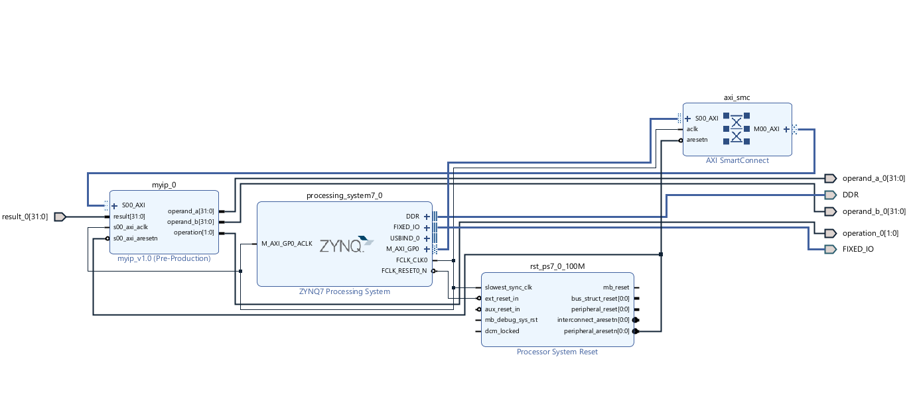
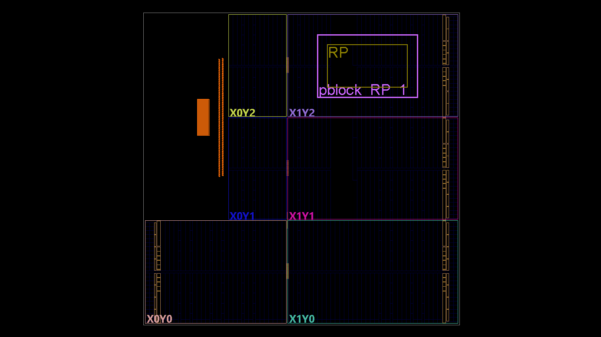
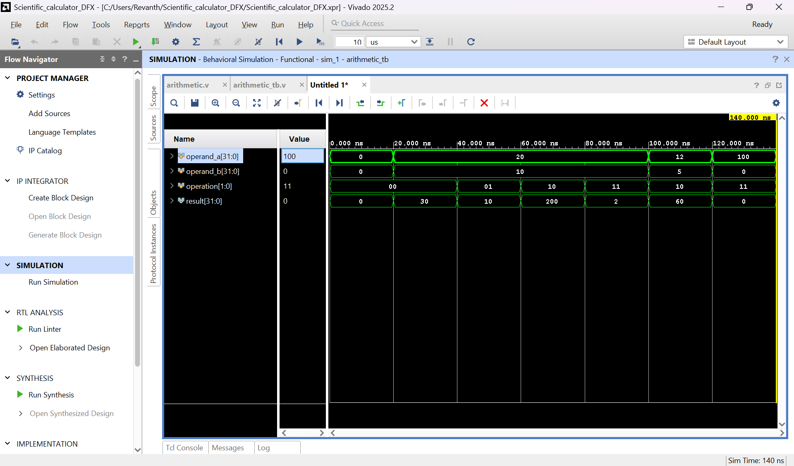
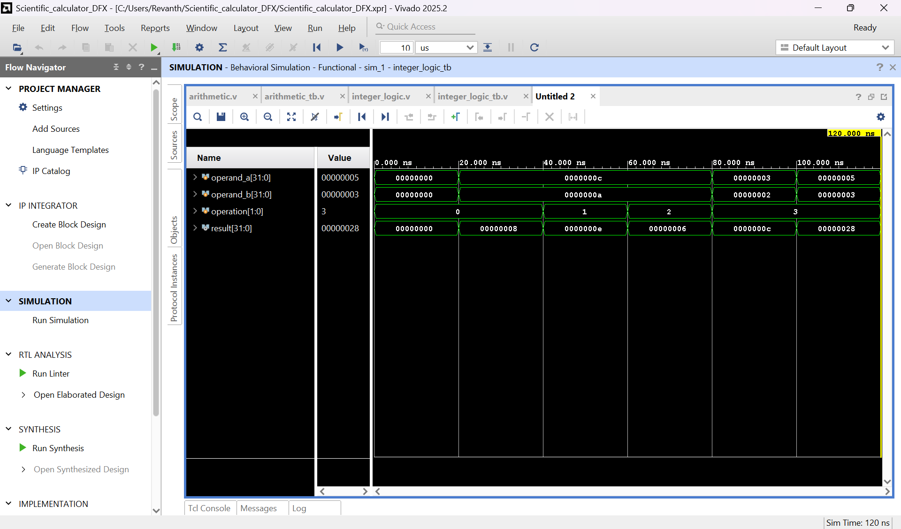

# DFX-Based Scientific Calculator

## CAPTURE THE BITSTREAM Hackathon — Problem 3

This directory contains my implementation of **Problem 3: Scientific Calculator** from the **CAPTURE THE BITSTREAM Hackathon** conducted as part of the DFX FPGA Workshop.

The objective of this problem is to demonstrate **Dynamic Function eXchange (DFX)** by implementing multiple calculator functions as reconfigurable modules that share a common Reconfigurable Partition (RP).

The design combines a **Zynq-7000 Processing System**, an **AXI4-Lite custom peripheral**, and a **Reconfigurable Partition** containing different calculator functions.

---

## Problem Overview

The scientific calculator is divided into three functional modules:

- **Arithmetic Module**
- **Integer Logic Module**
- **Decision Engine**

These modules are designed to operate through a common interface so that they can be used as different Reconfigurable Modules within the same Reconfigurable Partition.

The static portion of the system contains the processor and AXI infrastructure, while the calculator functionality is placed inside the reconfigurable region.

---

## System Architecture

The overall design consists of:

```text
                Zynq-7000 Processing System
                           |
                           |
                      AXI4-Lite
                           |
                           v
                  +----------------+
                  |  Custom AXI IP |
                  |     myip       |
                  +----------------+
                    |     |     |
                    |     |     |
               operand_a  |  operation
                          |
                      operand_b
                          |
                          v
                +--------------------+
                | Reconfigurable     |
                | Partition (RP)     |
                |                    |
                |  +--------------+  |
                |  | Calculator   |  |
                |  | Function     |  |
                |  +--------------+  |
                +--------------------+
                          |
                        result
                          |
                          v
                   Custom AXI IP
```

The AXI peripheral transfers operands and the operation selector from the Zynq Processing System to the programmable logic.

The calculated result is returned through the same AXI peripheral.

---

## Reconfigurable Modules

Three calculator implementations are provided.

### Arithmetic Module

File:

```text
rtl/arithmetic.v
```

This module implements the arithmetic operations required by the calculator.

It accepts:

```text
operand_a
operand_b
operation
```

and generates:

```text
result
```

---

### Integer Logic Module

File:

```text
rtl/integer_logic.v
```

This module implements integer/logic operations using the same external interface as the other calculator modules.

Maintaining an identical interface between the modules allows them to be used within the same Reconfigurable Partition.

---

### Decision Engine

File:

```text
rtl/decision_engine.v
```

The decision engine implements the decision/comparison functionality of the calculator.

Like the other modules, it uses the common interface:

```text
operand_a
operand_b
operation
result
```

---

## Reconfigurable Partition

The Reconfigurable Partition is represented by:

```text
rtl/rp_wrapper.v
```

The RP provides a common boundary for the different calculator implementations.

Because each Reconfigurable Module uses the same interface, the functionality inside this region can be changed while preserving the surrounding static design.

Conceptually:

```text
                       STATIC DESIGN

              +---------------------------+
              |                           |
operand_a --->|   +-------------------+   |
operand_b --->|   |                   |   |
operation --->|   |        RP         |   |----> result
              |   |                   |   |
              |   |  Arithmetic       |   |
              |   |       OR          |   |
              |   |  Integer Logic    |   |
              |   |       OR          |   |
              |   |  Decision Engine  |   |
              |   |                   |   |
              |   +-------------------+   |
              |                           |
              +---------------------------+
```

---

## Top-Level RTL

The static top-level design is contained in:

```text
rtl/top.v
```

The top-level module connects the external interface with the Reconfigurable Partition.

The separation between `top.v` and `rp_wrapper.v` provides the structural hierarchy required for the DFX design.

---

## AXI4-Lite Custom Peripheral

The calculator is connected to the Zynq Processing System through a custom **AXI4-Lite peripheral**.

The relevant source files are located in:

```text
ip/myip/
```

and include:

```text
myip.v
myip_slave_lite_v1_0_S00_AXI.v
```

### `myip.v`

`myip.v` is the top-level wrapper for the custom AXI peripheral.

The user-side calculator interface consists of:

```verilog
output wire [31:0] operand_a,
output wire [31:0] operand_b,
output wire [1:0]  operation,
input  wire [31:0] result
```

These signals connect the AXI register interface to the calculator logic.

### AXI Interface

The custom peripheral allows the Processing System to communicate with the calculator through AXI registers.

Conceptually:

```text
        ARM Processing System
                |
                |
             AXI4-Lite
                |
                v
      +----------------------+
      |      myip            |
      |                      |
      | AXI Register Logic   |
      +----------------------+
          |     |      |
          |     |      |
          v     v      v
      operand operand operation
         A       B
          \      |      /
           \     |     /
            v    v    v
          Calculator RP
                |
                |
              result
                |
                v
         AXI Register
```

---

## Vivado Block Design

The calculator system is integrated with the **Zynq-7000 Processing System** using Vivado IP Integrator.

The block design contains:

- **ZYNQ7 Processing System**
- **AXI SmartConnect**
- **Processor System Reset**
- **Custom `myip_0` AXI4-Lite peripheral**

The Zynq Processing System acts as the AXI master, while `myip_0` provides the interface between the processor and calculator logic.

The calculator operands and operation selection are passed from the AXI peripheral to the programmable logic, while the result is returned to the peripheral.



The Vivado block-design source is included at:

```text
block_design/calculator_system.bd
```

---

## DFX Physical Constraints

The Reconfigurable Partition is constrained to a dedicated FPGA region using a Vivado **Pblock**.

The constraints are located in:

```text
constraints/dfx_constraints.xdc
```

The Pblock is created using:

```tcl
create_pblock pblock_RP_1
```

The `RP` hierarchy is assigned to this Pblock using:

```tcl
add_cells_to_pblock [get_pblocks pblock_RP_1] \
    [get_cells -hierarchical -filter {NAME == "RP"}]
```

The physical region assigned to the RP contains SLICE, DSP48, RAMB18, and RAMB36 resources.

```tcl
resize_pblock [get_pblocks pblock_RP_1] -add {
    SLICE_X62Y110:SLICE_X103Y139
    DSP48_X3Y44:DSP48_X4Y55
    RAMB18_X4Y44:RAMB18_X4Y55
    RAMB36_X4Y22:RAMB36_X4Y27
}
```

Routing associated with the RP is constrained to remain within the region using:

```tcl
set_property CONTAIN_ROUTING true [get_pblocks pblock_RP_1]
```

The design also uses:

```tcl
set_property RESET_AFTER_RECONFIG false [get_pblocks pblock_RP_1]
```

---

## DFX Floorplanning

The following Vivado Device view shows the physical region allocated to the Reconfigurable Partition.

The highlighted `pblock_RP_1` region defines the FPGA resources reserved for the `RP` hierarchy.



This floorplanning step provides the physical boundary within which the reconfigurable calculator logic is placed.

---

## Behavioral Verification

The individual calculator modules were verified independently using **Vivado Behavioral Simulation**.

Separate testbenches were created for:

```text
tb/arithmetic_tb.v
tb/integer_logic_tb.v
tb/decision_engine_tb.v
```

Testing the modules independently verifies their functional behavior before their use in the DFX architecture.

---

## Arithmetic Module Simulation

The arithmetic module was simulated using different combinations of operands and operation selections.

Testbench:

```text
tb/arithmetic_tb.v
```

Simulation result:



The waveform demonstrates the arithmetic module responding to different values of:

```text
operand_a
operand_b
operation
```

and producing the corresponding `result`.

---

## Integer Logic Module Simulation

The integer logic module was verified independently using:

```text
tb/integer_logic_tb.v
```

Simulation result:



Multiple operand combinations and operation selections were applied to verify the implemented integer/logic functions.

---

## Decision Engine Simulation

The decision engine was verified using:

```text
tb/decision_engine_tb.v
```

Simulation result:


The waveform verifies the response of the decision engine for different operand values and operation selections.

---

## Project Structure

```text
problem3_Scientific_Calculator/
│
├── block_design/
│   └── calculator_system.bd
│
├── constraints/
│   └── dfx_constraints.xdc
│
├── images/
│   ├── arithmetic_simulation.png
│   ├── block_design.png
│   ├── decision_engine_simulation.png
│   ├── dfx_floorplanning.png
│   └── integer_logic_simulation.png
│
├── ip/
│   └── myip/
│       ├── myip.v
│       └── myip_slave_lite_v1_0_S00_AXI.v
│
├── rtl/
│   ├── arithmetic.v
│   ├── decision_engine.v
│   ├── integer_logic.v
│   ├── rp_wrapper.v
│   └── top.v
│
├── tb/
│   ├── arithmetic_tb.v
│   ├── decision_engine_tb.v
│   └── integer_logic_tb.v
│
└── README.md
```

---

## Design Flow

The development flow used for this project was:

```text
Calculator RTL Design
        |
        v
Behavioral Simulation
        |
        v
Common RP Interface
        |
        v
Reconfigurable Partition
        |
        v
AXI4-Lite Custom Peripheral
        |
        v
Zynq Processing System Integration
        |
        v
Vivado Block Design
        |
        v
DFX Pblock Constraints
        |
        v
DFX Floorplanning
```

---

## Tools and Platform

The project was developed using:

- **AMD Vivado 2025.2**
- **Verilog HDL**
- **AXI4-Lite**
- **Vivado IP Integrator**
- **Dynamic Function eXchange (DFX)**
- **Zynq-7000 SoC**

The Vivado block design targets:

```text
xc7z020clg400-1
```

---

## Key Concepts Demonstrated

This project demonstrates:

- Dynamic Function eXchange (DFX)
- Reconfigurable Modules
- Reconfigurable Partitions
- FPGA floorplanning using Pblocks
- AXI4-Lite peripheral design
- Zynq Processing System integration
- Vivado IP Integrator
- Modular Verilog RTL design
- Behavioral simulation
- Common interfaces between Reconfigurable Modules

---

## Hackathon Problem Statement

This implementation was developed for **Problem 3 – Scientific Calculator** of the **CAPTURE THE BITSTREAM Hackathon**.

The original hackathon problem statement is included at the root of this repository for reference:

```text
CAPTURE_THE_BITSTREAM_Hackathon_Problem_Statements.pdf
```

---

## Author

**Revanth A. H , Parthavi N. R**

CAPTURE THE BITSTREAM Hackathon  
DFX FPGA Workshop